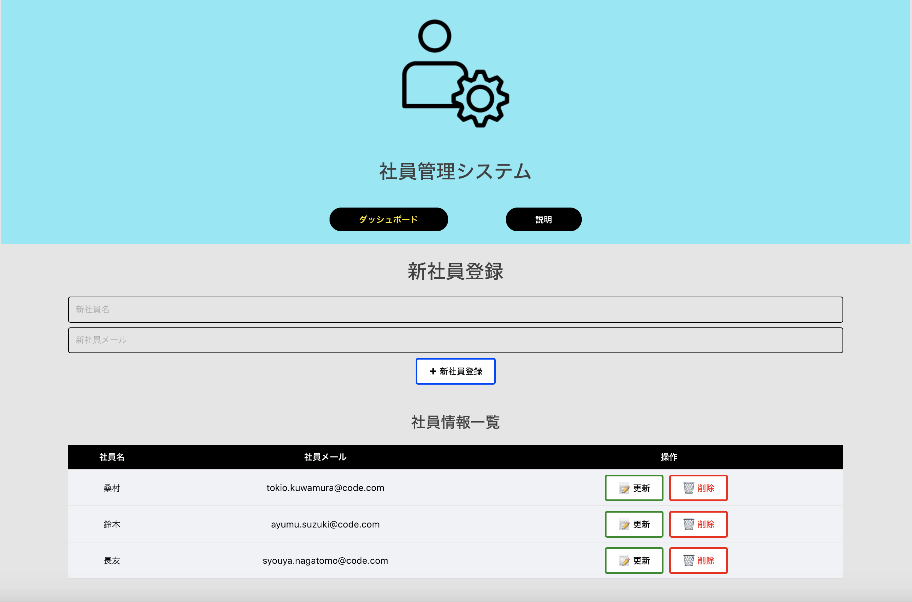

# 社員管理システム
社員管理システムとは、Web上でSPA（シンゲルページアプリケーション）です。社内で、社員管理の以下にある機能の操作ができます。
1. 社員情報一覧表示
2. 新社員登録
3. 存在されている社員の情報の更新
4. 存在されている社員の情報の削除

## URL
https://employee-manager-9acf8.web.app/

## 使用されたプログラミング言語
JavaScript

## 使用されたプログラミング言語フレームワーク
VueJS

### 使用された他の開発ツール
Vue-Router, Vuex

### デプロイメント
Firebase
